# 🏗️ GitHired - Complete System Architecture

## Table of Contents
1. [System Overview](#system-overview)
2. [Technology Stack](#technology-stack)
3. [Architecture Diagrams](#architecture-diagrams)
4. [Module Breakdown](#module-breakdown)
5. [NLP to SQL Workflow](#nlp-to-sql-workflow)
6. [Security & Validation](#security--validation)

---

## System Overview

**GitHired** is a full-stack job placement platform connecting students with companies, featuring AI-powered analytics, resume analysis, and natural language query capabilities.

### Core Value Propositions
- **Students**: Profile building, job discovery, ATS resume scanning, peer comparison
- **Companies**: Job posting, applicant tracking, hiring analytics  
- **Admins**: Platform management, analytics, approval workflows

---

## Technology Stack

### Frontend
- **Framework**: Next.js 15 (App Router, React 19, Server Components)
- **Styling**: TailwindCSS 4, shadcn/ui components
- **State Management**: React Query (@tanstack/react-query)
- **Rich Text**: TipTap editor
- **Charts**: Recharts
- **Animations**: Motion (Framer Motion)

### Backend
- **Runtime**: Node.js with Next.js API Routes
- **Database**: PostgreSQL (Neon serverless)
- **ORM**: Drizzle ORM
- **Authentication**: Better Auth (email/password + Google OAuth)
- **File Storage**: AWS S3 with presigned URLs
- **Email**: Resend + React Email

### AI/ML
- **Model**: Google Gemini 2.0 Flash (experimental)
- **Use Cases**: NLP to SQL, resume analysis, profile suggestions, insights generation

---

## Architecture Diagrams

### 1. High-Level System Architecture


### 2. Database Entity Relationship Diagram


### 3. Authentication & Authorization Flow


### 4. NLP to SQL Complete Workflow


### 5. SQL Validation Security Layers

```mermaid
graph TD
    SQL[Generated SQL Query] --> Layer1[Layer 1: Basic Validation]
    
    Layer1 --> L1_1{Starts with SELECT<br/>or WITH?}
    L1_1 --> |No| Reject1[❌ Reject: Only SELECT allowed]
    L1_1 --> |Yes| L1_2{Multiple statements<br/>semicolons?}
    
    L1_2 --> |Yes| Reject2[❌ Reject: SQL injection attempt]
    L1_2 --> |No| L1_3{Contains SQL<br/>comments?}
    
    L1_3 --> |Yes| Reject3[❌ Reject: Comments not allowed]
    L1_3 --> |No| Layer2[Layer 2: Keyword Validation]
    
    Layer2 --> L2_1{Contains forbidden<br/>keywords?}
    L2_1 --> |Yes| Reject4["❌ Reject: DROP, DELETE,<br/>INSERT, UPDATE not allowed"]
    L2_1 --> |No| Layer3[Layer 3: Table Permissions]
    
    Layer3 --> L3_1[Extract table names<br/>FROM/JOIN clauses]
    L3_1 --> L3_2[Filter out:<br/>- PostgreSQL functions unnest<br/>- CTE names<br/>- Aliases]
    L3_2 --> L3_3{All tables<br/>allowed for role?}
    
    L3_3 --> |No| Reject5[❌ Reject: Access denied<br/>to table]
    L3_3 --> |Yes| Layer4[Layer 4: Column Security]
    
    Layer4 --> L4_1{Contains sensitive<br/>columns?}
    L4_1 --> |Yes| Reject6["❌ Reject: password, token,<br/>admin_note not allowed"]
    L4_1 --> |No| Layer5[Layer 5: Role-Based Filters]
    
    Layer5 --> L5_1{User Role?}
    L5_1 --> |Student| Student[Inject:<br/>WHERE student_id = 'X']
    L5_1 --> |Company| Company[Inject:<br/>WHERE company_id = 'Y']
    L5_1 --> |Admin| Admin[No filter needed]
    
    Student & Company & Admin --> Safe[✅ Safe to Execute]
    
    style SQL fill:#e3f2fd
    style Layer1 fill:#fff9c4
    style Layer2 fill:#fff9c4
    style Layer3 fill:#fff9c4
    style Layer4 fill:#fff9c4
    style Layer5 fill:#fff9c4
    style Safe fill:#c8e6c9
    style Reject1 fill:#ffcdd2
    style Reject2 fill:#ffcdd2
    style Reject3 fill:#ffcdd2
    style Reject4 fill:#ffcdd2
    style Reject5 fill:#ffcdd2
    style Reject6 fill:#ffcdd2
```



### 6. Role Permissions Matrix


### 7. Student Application Workflow

```mermaid
sequenceDiagram
    participant S as Student
    participant UI as Frontend
    participant API as API Route
    participant DB as Database
    participant Email as Email Service
    participant C as Company
    
    S->>UI: Browse Jobs (/dashboard/jobs)
    UI->>API: GET /api/student/jobs
    API->>DB: Query active jobs
    DB-->>API: Return jobs (filtered by eligibility)
    API-->>UI: Job listings
    UI-->>S: Display eligible jobs
    
    S->>UI: Click "Apply" on job
    UI->>UI: Show resume selector modal
    S->>UI: Select resume + write cover letter
    
    UI->>API: POST /api/student/applications
    API->>DB: Check eligibility:<br/>- CGPA >= cutoff<br/>- Course in eligible list<br/>- Not already applied
    
    alt Eligible
        DB-->>API: ✅ Eligible
        API->>DB: Create application record:<br/>- Snapshot student data<br/>- Link resume<br/>- Status: pending
        DB-->>API: Application created
        
        API->>DB: Update analytics:<br/>- student.applications++<br/>- job.applications++
        
        API-->>UI: Success response
        UI-->>S: "Application submitted!"
        
        API->>Email: Notify company (optional)
        Email-->>C: New application email
    else Not Eligible
        DB-->>API: ❌ Not eligible
        API-->>UI: Error: "You don't meet requirements"
        UI-->>S: Show error message
    end
```



### 8. ATS Resume Analysis Workflow

```mermaid
flowchart TD
    Start([Student uploads resume]) --> Upload[Upload to S3<br/>via presigned URL]
    
    Upload --> Trigger[Trigger ATS Analysis]
    
    Trigger --> Fetch[Fetch PDF from S3]
    
    Fetch --> Extract[Extract Text<br/>using pdf-parse]
    
    Extract --> Check{Job Description<br/>provided?}
    
    Check --> |Yes| PromptJD[Build Prompt:<br/>- Resume text<br/>- Job description<br/>- Compare keywords]
    Check --> |No| PromptGeneral[Build Prompt:<br/>- Resume text<br/>- General best practices]
    
    PromptJD & PromptGeneral --> Gemini[Gemini API Call]
    
    Gemini --> Parse{Parse Response}
    
    Parse --> Score[Overall Score: 0-100<br/>Based on actual quality]
    Parse --> Format[Formatting Score: 0-100<br/>- ATS compatibility<br/>- Structure issues]
    Parse --> Content[Content Score: 0-100<br/>- Action verbs<br/>- Achievements]
    Parse --> Keywords[Keyword Analysis:<br/>- Matched keywords<br/>- Missing keywords]
    Parse --> Feedback[Feedback:<br/>- Strengths<br/>- Weaknesses<br/>- Suggestions]
    
    Score & Format & Content & Keywords & Feedback --> Combine[Combine Analysis]
    
    Combine --> Save[Save to atsScans table]
    
    Save --> Display{Display Results}
    
    Display --> Visual[Visual Breakdown:<br/>📊 Score gauges<br/>✅ Strengths list<br/>❌ Weaknesses list<br/>💡 Suggestions<br/>🔍 Keywords]
    
    Visual --> End([Student views analysis])
    
    style Start fill:#e1f5ff
    style Gemini fill:#fff4e1
    style Save fill:#e8f5e9
    style End fill:#e1f5ff
```



### 9. Module Dependencies


### 10. Data Flow - Complete Journey


---

## Module Breakdown

### 1. Authentication Module (`lib/auth.ts`)

**Responsibilities:**
- User registration (email/password + Google OAuth)
- Session management (7-day sessions)
- Email verification
- Password reset
- Role assignment

**Key Functions:**
```typescript
auth.api.signIn()
auth.api.signUp()
auth.api.getSession()
auth.api.sendVerificationEmail()
auth.api.resetPassword()
```

**Flow:**
1. User signs up → Create user record
2. Send verification email (Resend)
3. User verifies → Set `emailVerified = true`
4. Redirect to `/select-role`
5. User selects role → Create profile (student/company)
6. Profile status: `pending` → Awaits admin approval

---

### 2. SQL Validator Module (`lib/ai/sql-validator.ts`)

**Core Security Functions:**

#### `validateSQL(sql: string, role: string): void`
- Checks for forbidden keywords (DROP, DELETE, etc.)
- Validates SELECT-only queries
- Checks table permissions
- Blocks sensitive columns

#### `addRoleBasedFilters(sql, role, context): string`
- Automatically injects WHERE clauses
- Handles CTEs (Common Table Expressions)
- Supports subqueries and aliases
- Prevents cross-user data access

**Permission Rules:**
```typescript
ROLE_PERMISSIONS = {
  student: {
    students: { 
      allowed: true, 
      conditions: "students.user_id = :currentUserId" 
    },
    jobs: { allowed: true, conditions: "jobs.status = 'active'" },
    applications: { 
      allowed: true, 
      conditions: "applications.student_id = :currentStudentId" 
    }
  },
  company: { /* similar */ },
  admin: { /* full access */ }
}
```

---

### 3. Query Generator Module (`lib/ai/query-generator.ts`)

**Core Function:**
```typescript
async function convertQueryToSQL(
  naturalQuery: string,
  role: "student" | "company" | "admin",
  context: { userId, studentId, companyId }
): Promise<QueryResponse>
```

**Process:**
1. Build context prompt with database schema
2. Include role permissions
3. Add PostgreSQL-specific examples (arrays, JSONB)
4. Send to Gemini with structured output schema
5. Parse response: `{ sql, explanation, chartType, visualization }`

**Database Schema Information:**
- Table definitions with column types
- Array column handling (TEXT[], JSONB)
- Common query patterns
- CGPA casting rules (TEXT → NUMERIC)

---

### 4. ATS Analyzer Module (`lib/ai/ats-analyzer.ts`)

**Core Function:**
```typescript
async function analyzeResumeATS(
  resumeUrl: string,
  jobDescription?: string
): Promise<ATSAnalysis>
```

**Analysis Components:**
- **Overall Score** (0-100): ATS compatibility rating
- **Formatting Score** (0-100): Structure, no columns/graphics
- **Content Score** (0-100): Action verbs, quantifiable achievements
- **Keyword Matching**: Present vs missing keywords (if JD provided)
- **Strengths**: 3-5 positive aspects
- **Weaknesses**: 3-5 areas for improvement
- **Suggestions**: 5-8 actionable recommendations

**Key Features:**
- Realistic scoring (uses full 0-100 range)
- PDF text extraction via `pdf-parse`
- Targeted analysis with job descriptions
- General best practices without JD

---

### 5. Profile Analyzer Module (`lib/ai/profile-analyzer.ts`)

**Core Function:**
```typescript
async function analyzeProfileGaps(
  studentId: string
): Promise<ProfileGap[]>
```

**Analysis Process:**
1. Fetch student profile data
2. Query active jobs for market insights
3. Extract top skills in demand
4. Calculate average requirements
5. Send to Gemini for gap analysis
6. Return 3-5 prioritized gaps with action items

**Gap Categories:**
- `projects`: Insufficient project portfolio
- `skills`: Missing in-demand technologies
- `certifications`: Industry credentials needed
- `experience`: Work experience gaps
- `education`: Missing courses/achievements

---

### 6. Peer Comparison Module (`lib/analytics/peer-comparison.ts`)

**Metrics Calculated:**

#### CGPA Comparison
```typescript
{
  yourCgpa: 8.5,
  average: 7.8,
  percentile: 75,  // Better than 75% of students
  rank: 12,        // 12th position
  total: 50        // Total students
}
```

#### Profile Completeness (100 points)
- Basic info (20): phone, CGPA, degree, course
- Skills (15): 0/5/10+ skills
- Projects (15): 0/2/3+ projects
- Experience (15): 0/1/2+ entries
- Certifications (10): 0/1/2+ certs
- Resume (10): uploaded
- Profile links (10): GitHub, LinkedIn, portfolio
- Bio (5): filled

---

## NLP to SQL Workflow (Detailed)

### Phase 1: Query Generation

**Input:**
```
Natural Query: "What are my top 5 skills compared to job requirements?"
Role: student
Context: { userId: "123", studentId: "456" }
```

**Prompt Construction:**
```
You are a PostgreSQL SQL expert...

USER ROLE: student
ALLOWED TABLES: students, jobs, applications, companies

DATABASE SCHEMA:
students:
  - skills (text[]) - use unnest(skills) to expand
jobs:
  - skills (text[]) - use unnest(skills) to expand

QUERY: "What are my top 5 skills compared to job requirements?"

REQUIREMENTS:
1. Generate valid PostgreSQL SELECT
2. Handle TEXT[] arrays with unnest()
3. Cast CGPA to NUMERIC for comparisons
4. Suggest appropriate chart type
```

**Gemini Response:**
```json
{
  "sql": "WITH my_skills AS (SELECT unnest(skills) as skill FROM students WHERE id = '{studentId}'), job_skills AS (SELECT unnest(skills) as skill FROM jobs WHERE status = 'active') SELECT my_skills.skill, COUNT(DISTINCT job_skills.skill) as demand FROM my_skills LEFT JOIN job_skills ON my_skills.skill = job_skills.skill GROUP BY my_skills.skill ORDER BY demand DESC LIMIT 5",
  "explanation": "This query finds your top 5 skills that are most in-demand across active job postings",
  "chartType": "bar",
  "visualization": {
    "xAxis": "skill",
    "yAxis": "demand",
    "groupBy": "skill"
  }
}
```

### Phase 2: SQL Validation

**Validation Steps:**
1. ✅ Starts with SELECT
2. ✅ No forbidden keywords (DROP, DELETE, etc.)
3. ✅ No multiple statements
4. ✅ No SQL comments
5. ✅ Extract tables: `students`, `jobs`
6. ✅ Check permissions: Student can access both
7. ✅ No sensitive columns referenced

### Phase 3: Filter Injection

**Before:**
```sql
SELECT unnest(skills) FROM students
```

**After (Role-Based Filter):**
```sql
SELECT unnest(skills) FROM students 
WHERE students.id = '456'
```

**Complex Query Example:**

**Before:**
```sql
WITH my_apps AS (
  SELECT * FROM applications
)
SELECT * FROM my_apps
```

**After:**
```sql
WITH my_apps AS (
  SELECT * FROM applications 
  WHERE applications.student_id = '456'
)
SELECT * FROM my_apps
```

### Phase 4: Execution & Insights

**Execution:**
```typescript
const result = await db.execute(sql.raw(modifiedSQL));
// With 10-second timeout
```

**Results:**
```json
[
  { skill: "React", demand: 25 },
  { skill: "Node.js", demand: 20 },
  { skill: "Python", demand: 18 },
  { skill: "TypeScript", demand: 15 },
  { skill: "AWS", demand: 12 }
]
```

**Insights Generation:**
```
Analyze the following data and provide 3-5 key insights...

DATA: [results]
```

**Gemini Insights:**
```markdown
- React is your most valuable skill, appearing in 25 job postings
- Full-stack combo of React + Node.js makes you competitive for 20+ positions
- Python and TypeScript are trending - great additions to your skillset
- AWS cloud experience is in high demand (12 postings)
- Consider adding Docker/Kubernetes to complement your AWS skills
```

---

## Security & Validation

### Multi-Layer Security Architecture

```
Layer 1: Middleware (Route Protection)
  ↓
Layer 2: Session Validation (Better Auth)
  ↓
Layer 3: Role Check (student/company/admin)
  ↓
Layer 4: Resource Ownership (userId/studentId/companyId)
  ↓
Layer 5: SQL Validation (Whitelist/Blacklist)
  ↓
Layer 6: Permission Matrix (Table access by role)
  ↓
Layer 7: Sensitive Column Blocking
  ↓
Layer 8: Role-Based Filter Injection
  ↓
Layer 9: Query Timeout (10 seconds)
  ↓
Execution ✅
```

### Common Attack Vectors & Protections

#### 1. SQL Injection
**Attack:**
```
User input: "'; DROP TABLE students; --"
```

**Protection:**
- Middleware blocks multiple statements (semicolon check)
- Validator rejects forbidden keywords (DROP)
- Validator blocks SQL comments (`--`)

#### 2. Unauthorized Table Access
**Attack:**
```
Student tries: "SELECT password FROM account"
```

**Protection:**
- Table permission check: Student cannot access `account` table
- Sensitive column check: `password` is blocked

#### 3. Cross-User Data Access
**Attack:**
```
Student tries: "SELECT * FROM students WHERE id != '456'"
```

**Protection:**
- Role-based filter injection automatically adds:
  `WHERE students.id = '456'`
- Student only sees their own data

#### 4. Privilege Escalation
**Attack:**
```
Company tries to access: "/dashboard/admin"
```

**Protection:**
- Middleware checks role before allowing route access
- Redirects company to `/dashboard/company`

---

## Performance Optimizations

### Database Indexing
```sql
CREATE INDEX idx_students_status_created_at ON students(status, created_at DESC);
CREATE INDEX idx_jobs_company_id ON jobs(company_id);
CREATE INDEX idx_applications_job_id ON applications(job_id);
CREATE INDEX idx_applications_student_id ON applications(student_id);
CREATE INDEX idx_ai_queries_user_id ON ai_queries(user_id);
```

### Caching Strategy
- **React Query**: Client-side caching with stale-while-revalidate
- **Query Results**: Store in `aiQueries` table for history
- **Profile Suggestions**: Cached in `profileSuggestions` table

### Serverless Scaling
- **Neon PostgreSQL**: Auto-scaling serverless database
- **Vercel Edge**: Global CDN for static assets
- **AWS S3 + CloudFront**: Resume file delivery

---

## API Endpoints Summary

### Student APIs
- `POST /api/student/profile` - Update profile
- `GET /api/student/jobs` - Browse jobs
- `POST /api/student/applications` - Apply to job
- `POST /api/student/ats-scan` - Analyze resume
- `GET /api/student/peer-comparison` - Compare with peers
- `GET /api/student/profile-suggestions` - Get improvement suggestions

### Company APIs
- `POST /api/company/profile` - Update company profile
- `POST /api/company/jobs` - Create job posting
- `GET /api/company/applications` - View applications
- `PATCH /api/company/applications/:id` - Update application status

### Admin APIs
- `GET /api/admin/students` - List all students
- `GET /api/admin/companies` - List all companies
- `PATCH /api/admin/students/:id` - Approve/reject student
- `PATCH /api/admin/companies/:id` - Approve/reject company

### AI APIs
- `POST /api/ai/query` - Execute natural language query
- `GET /api/ai/query` - Get query history
- `DELETE /api/ai/query` - Clear history
- `GET /api/ai/templates` - Get query templates

---

## Deployment Architecture

```
┌─────────────────────────────────────────────────────┐
│                    Production Stack                  │
└─────────────────────────────────────────────────────┘

Frontend:              Vercel (Next.js)
  ├─ Edge Network:     Global CDN
  ├─ Build:            Turbopack
  └─ Region:           Auto (closest to user)

Database:              Neon (PostgreSQL Serverless)
  ├─ Connection:       Pooling enabled
  ├─ Backups:          Automatic daily
  └─ Region:           us-east-1

File Storage:          AWS S3
  ├─ Bucket:           Private (presigned URLs)
  ├─ CDN:              CloudFront (optional)
  └─ Region:           us-east-1

AI Service:            Google Gemini
  ├─ Model:            gemini-2.0-flash-exp
  ├─ Rate Limit:       60 RPM
  └─ Timeout:          10 seconds

Email Service:         Resend
  ├─ Provider:         AWS SES
  ├─ Domain:           Custom (if configured)
  └─ Templates:        React Email

Analytics:             Vercel Analytics
  └─ Web Vitals:       Core performance metrics
```

---

## Key Takeaways

✅ **Security-First Design**: Multi-layer validation prevents SQL injection, unauthorized access, and data leaks

✅ **AI-Powered Intelligence**: Gemini integration for NLP queries, resume analysis, and profile insights

✅ **Role-Based Architecture**: Separate workflows for students, companies, and admins

✅ **Scalable Infrastructure**: Serverless database, S3 storage, edge CDN

✅ **Type-Safe Development**: TypeScript + Drizzle ORM + Zod validation

✅ **Modern Stack**: Next.js 15, React 19, TailwindCSS 4, Gemini 2.0

---

**GitHired** is production-ready with enterprise-grade security, AI-powered analytics, and a scalable architecture! 🚀

