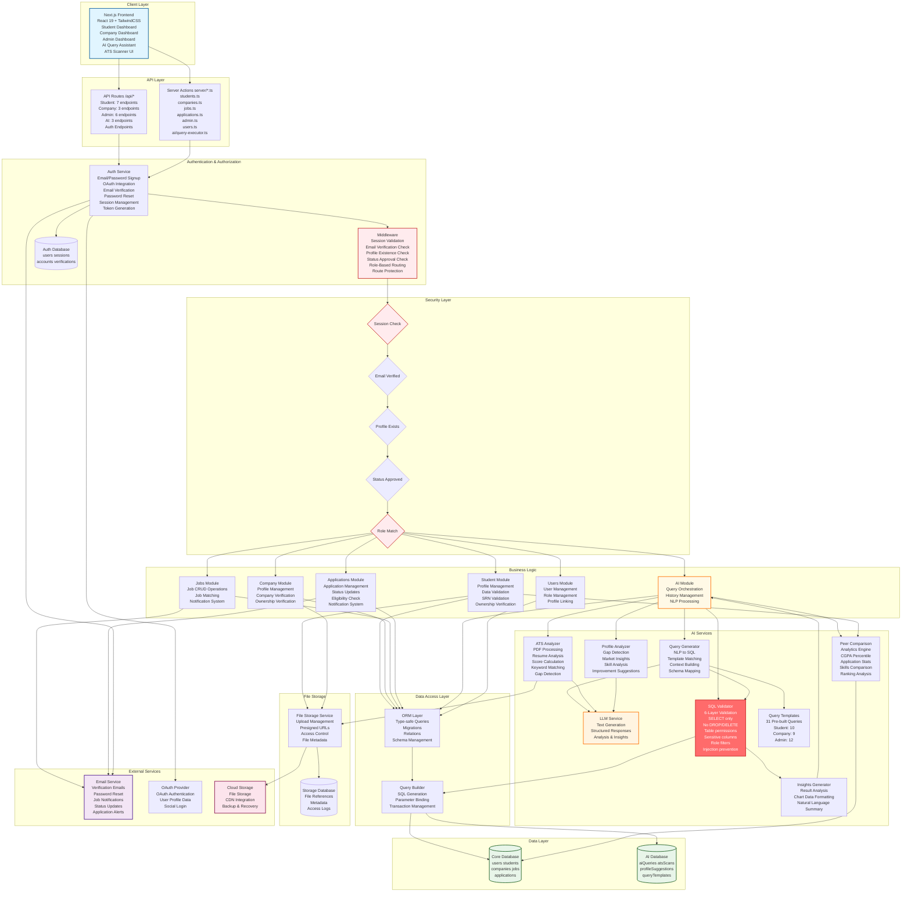

# GitHired - Core Architecture Diagram

```mermaid
graph TB

    subgraph "Client Layer"
        A["Next.js Frontend<br/>React 19 + TailwindCSS<br/>Student Dashboard<br/>Company Dashboard<br/>Admin Dashboard<br/>AI Query Assistant<br/>ATS Scanner UI"]
    end

    subgraph "API Layer"
        B["API Routes /api/*<br/>Student: 7 endpoints<br/>Company: 3 endpoints<br/>Admin: 6 endpoints<br/>AI: 3 endpoints<br/>Auth Endpoints"]
        
        C["Server Actions server/*.ts<br/>students.ts<br/>companies.ts<br/>jobs.ts<br/>applications.ts<br/>admin.ts<br/>users.ts<br/>ai/query-executor.ts"]
    end

    subgraph "Authentication & Authorization"
        D["Auth Service<br/>Email/Password Signup<br/>OAuth Integration<br/>Email Verification<br/>Password Reset<br/>Session Management<br/>Token Generation"]
        
        E["Middleware<br/>Session Validation<br/>Email Verification Check<br/>Profile Existence Check<br/>Status Approval Check<br/>Role-Based Routing<br/>Route Protection"]
        
        AuthDB[(Auth Database<br/>users sessions<br/>accounts verifications)]
    end

    subgraph "Security Layer"
        SessionCheck{Session Check}
        EmailCheck{Email Verified}
        ProfileCheck{Profile Exists}
        StatusCheck{Status Approved}
        RoleCheck{Role Match}
        
        SessionCheck --> EmailCheck
        EmailCheck --> ProfileCheck
        ProfileCheck --> StatusCheck
        StatusCheck --> RoleCheck
    end

    subgraph "Business Logic"
        F["Student Module<br/>Profile Management<br/>Data Validation<br/>SRN Validation<br/>Ownership Verification"]
        
        G["Company Module<br/>Profile Management<br/>Company Verification<br/>Ownership Verification"]
        
        H["Jobs Module<br/>Job CRUD Operations<br/>Job Matching<br/>Notification System"]
        
        I["Applications Module<br/>Application Management<br/>Status Updates<br/>Eligibility Check<br/>Notification System"]
        
        J["AI Module<br/>Query Orchestration<br/>History Management<br/>NLP Processing"]
        
        U["Users Module<br/>User Management<br/>Role Management<br/>Profile Linking"]
    end

    subgraph "AI Services"
        LLM["LLM Service<br/>Text Generation<br/>Structured Responses<br/>Analysis & Insights"]
        
        QueryGen["Query Generator<br/>NLP to SQL<br/>Template Matching<br/>Context Building<br/>Schema Mapping"]
        
        ATSAnalyzer["ATS Analyzer<br/>PDF Processing<br/>Resume Analysis<br/>Score Calculation<br/>Keyword Matching<br/>Gap Detection"]
        
        ProfileAnalyzer["Profile Analyzer<br/>Gap Detection<br/>Market Insights<br/>Skill Analysis<br/>Improvement Suggestions"]
        
        SQLValidator["SQL Validator<br/>6-Layer Validation<br/>SELECT only<br/>No DROP/DELETE<br/>Table permissions<br/>Sensitive columns<br/>Role filters<br/>Injection prevention"]
        
        Templates["Query Templates<br/>31 Pre-built Queries<br/>Student: 10<br/>Company: 9<br/>Admin: 12"]
        
        PeerComp["Peer Comparison<br/>Analytics Engine<br/>CGPA Percentile<br/>Application Stats<br/>Skills Comparison<br/>Ranking Analysis"]
        
        InsightsGen["Insights Generator<br/>Result Analysis<br/>Chart Data Formatting<br/>Natural Language Summary"]
    end

    subgraph "Data Access Layer"
        ORM["ORM Layer<br/>Type-safe Queries<br/>Migrations<br/>Relations<br/>Schema Management"]
        
        QueryBuilder["Query Builder<br/>SQL Generation<br/>Parameter Binding<br/>Transaction Management"]
    end

    subgraph "Data Layer"
        CoreDB[(Core Database<br/>users students<br/>companies jobs<br/>applications)]
        
        AIDB[(AI Database<br/>aiQueries atsScans<br/>profileSuggestions<br/>queryTemplates)]
    end

    subgraph "File Storage"
        FileStorage["File Storage Service<br/>Upload Management<br/>Presigned URLs<br/>Access Control<br/>File Metadata"]
        
        StorageDB[(Storage Database<br/>File References<br/>Metadata<br/>Access Logs)]
    end

    subgraph "External Services"
        EmailService["Email Service<br/>Verification Emails<br/>Password Reset<br/>Job Notifications<br/>Status Updates<br/>Application Alerts"]
        
        OAuthProvider["OAuth Provider<br/>OAuth Authentication<br/>User Profile Data<br/>Social Login"]
        
        CloudStorage["Cloud Storage<br/>File Storage<br/>CDN Integration<br/>Backup & Recovery"]
    end

    A --> B
    A --> C
    B --> D
    C --> D
    D --> AuthDB
    D --> E
    E --> SessionCheck
    RoleCheck --> F & G & H & I & J & U

    J --> QueryGen & ATSAnalyzer & ProfileAnalyzer & SQLValidator
    QueryGen --> LLM
    QueryGen --> Templates
    QueryGen --> SQLValidator
    ATSAnalyzer --> LLM
    ProfileAnalyzer --> LLM
    SQLValidator --> QueryBuilder
    SQLValidator --> InsightsGen
    InsightsGen --> J
    J --> PeerComp

    F & G & H & I & J & U --> ORM
    ORM --> QueryBuilder
    QueryBuilder --> CoreDB
    QueryBuilder --> AIDB

    F & G --> FileStorage
    FileStorage --> StorageDB
    FileStorage --> CloudStorage

    F --> PeerComp
    PeerComp --> CoreDB

    H --> EmailService
    I --> EmailService
    D --> EmailService
    D --> OAuthProvider

    ATSAnalyzer --> FileStorage

    style A fill:#e1f5ff,stroke:#01579b,stroke-width:2px
    style LLM fill:#fff4e1,stroke:#ff6f00,stroke-width:2px
    style CoreDB fill:#e8f5e9,stroke:#1b5e20,stroke-width:2px
    style AIDB fill:#e8f5e9,stroke:#1b5e20,stroke-width:2px
    style CloudStorage fill:#fce4ec,stroke:#880e4f,stroke-width:2px
    style EmailService fill:#f3e5f5,stroke:#4a148c,stroke-width:2px
    style E fill:#ffebee,stroke:#c62828,stroke-width:2px
    style SQLValidator fill:#ff6b6b,stroke:#c92a2a,stroke-width:2px,color:#fff
    style J fill:#fff9e6,stroke:#ff6f00,stroke-width:2px
    style SessionCheck fill:#ffebee,stroke:#c62828,stroke-width:2px
    style RoleCheck fill:#ffebee,stroke:#c62828,stroke-width:2px
```
