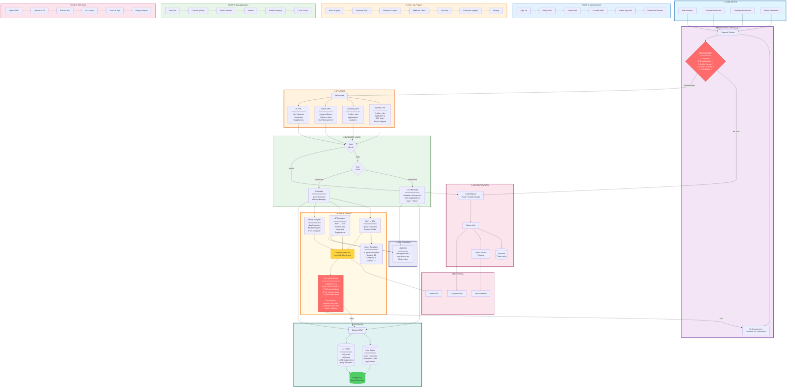

# GitHired - Simplified System Architecture

```mermaid
flowchart TB
    subgraph USER["👤 USER LAYER"]
        Browser[Web Browser]
        Student[Student Dashboard]
        Company[Company Dashboard]
        Admin[Admin Dashboard]
    end

    subgraph FRONTEND["🖥️ FRONTEND - Next.js 15"]
        Pages[Pages & Routes]
        UI[UI Components<br/>TailwindCSS + shadcn/ui]
        
        Middleware{MIDDLEWARE<br/>════════<br/>1. Session ✓<br/>2. Email Verified ✓<br/>3. Profile Exists ✓<br/>4. Status Approved ✓<br/>5. Role Match ✓}
    end

    subgraph AUTH["🔐 AUTHENTICATION"]
        BetterAuth[Better Auth]
        AuthFlow[Login/Signup<br/>Email + OAuth Google]
        EmailService[Email Service<br/>Resend]
        Sessions[(Sessions<br/>7-day expiry)]
    end

    subgraph API["🔌 API LAYER"]
        Routes[API Routes]
        
        StudentAPIs[Student APIs<br/>───────────<br/>Profile • Jobs<br/>Applications<br/>ATS Scan<br/>Peer Compare]
        
        CompanyAPIs[Company APIs<br/>───────────<br/>Profile • Jobs<br/>Applications<br/>Analytics]
        
        AdminAPIs[Admin APIs<br/>───────────<br/>Approve/Reject<br/>Platform Stats<br/>User Management]
        
        AIAPIs[AI APIs<br/>───────────<br/>NLP Queries<br/>Templates<br/>Suggestions]
    end

    subgraph BUSINESS["💼 BUSINESS LOGIC"]
        AuthCheck{Auth<br/>Check}
        RoleCheck{Role<br/>Check}
        
        Core[Core Modules<br/>═══════════<br/>Students • Companies<br/>Jobs • Applications<br/>Users • Admin]
        
        AIModule[AI Module<br/>═══════════<br/>Query Executor<br/>History Manager]
    end

    subgraph AI["🤖 AI PROCESSING"]
        GeminiAPI[Google Gemini API<br/>gemini-2.0-flash-exp]
        
        NLP[NLP → SQL<br/>══════════<br/>Query Generator<br/>Context Builder]
        
        Validator[SQL VALIDATOR<br/>══════════════<br/>✓ SELECT only<br/>✗ No DROP/DELETE<br/>✓ Table permissions<br/>✗ No sensitive data<br/>✓ Role-based filters<br/><br/>Permissions:<br/>Student: Own data<br/>Company: Own jobs<br/>Admin: All data]
        
        ATS[ATS Analyzer<br/>══════════<br/>PDF → Text<br/>Score 0-100<br/>Keywords<br/>Suggestions]
        
        Profile[Profile Analyzer<br/>══════════<br/>Gap Detection<br/>Market Insights<br/>Peer Compare]
        
        Templates[Query Templates<br/>══════════<br/>31 pre-built queries<br/>Student: 10<br/>Company: 9<br/>Admin: 12]
    end

    subgraph DATA["🗄️ DATABASE"]
        Drizzle[Drizzle ORM]
        
        CoreTables[(Core Tables<br/>═════════<br/>users • students<br/>companies • jobs<br/>applications)]
        
        AITables[(AI Tables<br/>═════════<br/>aiQueries<br/>atsScans<br/>profileSuggestions<br/>queryTemplates)]
        
        Postgres[(PostgreSQL<br/>Neon Serverless)]
    end

    subgraph STORAGE["💾 FILE STORAGE"]
        S3[AWS S3<br/>════════<br/>Presigned URLs<br/>Resume PDFs<br/>15min expiry]
    end

    subgraph EXTERNAL["🌐 EXTERNAL"]
        GoogleOAuth[Google OAuth]
        ResendAPI[Resend Email]
        GeminiExt[Gemini API]
    end

    %% USER TO FRONTEND
    Browser --> Pages
    Student --> Pages
    Company --> Pages
    Admin --> Pages
    
    Pages --> UI
    Pages --> Middleware
    
    %% MIDDLEWARE TO AUTH
    Middleware -->|No Auth| AuthFlow
    Middleware -->|Authenticated| Routes
    
    %% AUTH FLOW
    AuthFlow --> BetterAuth
    BetterAuth --> Sessions
    BetterAuth --> EmailService
    BetterAuth --> GoogleOAuth
    EmailService --> ResendAPI
    
    %% API ROUTING
    Routes --> StudentAPIs
    Routes --> CompanyAPIs
    Routes --> AdminAPIs
    Routes --> AIAPIs
    
    %% API TO BUSINESS
    StudentAPIs --> AuthCheck
    CompanyAPIs --> AuthCheck
    AdminAPIs --> AuthCheck
    AIAPIs --> AuthCheck
    
    AuthCheck -->|Valid| RoleCheck
    AuthCheck -->|Invalid| AuthFlow
    
    RoleCheck -->|Authorized| Core
    RoleCheck -->|Authorized| AIModule
    
    %% AI WORKFLOWS
    AIModule --> NLP
    NLP --> Templates
    NLP --> GeminiAPI
    GeminiAPI --> GeminiExt
    GeminiAPI --> Validator
    
    Validator -->|Pass| Drizzle
    Validator -->|Fail| UI
    
    AIModule --> ATS
    ATS --> GeminiAPI
    ATS --> S3
    
    AIModule --> Profile
    Profile --> GeminiAPI
    
    %% BUSINESS TO DATA
    Core --> Drizzle
    AIModule --> Drizzle
    
    Drizzle --> CoreTables
    Drizzle --> AITables
    
    CoreTables --> Postgres
    AITables --> Postgres
    
    %% STORAGE
    Core --> S3
    ATS --> S3
    
    %% KEY FLOWS HIGHLIGHT
    subgraph FLOW1["FLOW 1: Authentication"]
        direction LR
        A1[Sign Up] --> A2[Verify Email] --> A3[Select Role] --> A4[Create Profile] --> A5[Admin Approval] --> A6[Dashboard Access]
    end
    
    subgraph FLOW2["FLOW 2: NLP Query"]
        direction LR
        B1[Natural Query] --> B2[Generate SQL] --> B3[Validate 6 Layers] --> B4[Add Role Filters] --> B5[Execute] --> B6[Generate Insights] --> B7[Display]
    end
    
    subgraph FLOW3["FLOW 3: Job Application"]
        direction LR
        C1[View Job] --> C2[Check Eligibility] --> C3[Select Resume] --> C4[Submit] --> C5[Notify Company] --> C6[Track Status]
    end
    
    subgraph FLOW4["FLOW 4: ATS Scan"]
        direction LR
        D1[Upload PDF] --> D2[Upload to S3] --> D3[Extract Text] --> D4[AI Analysis] --> D5[Score & Tips] --> D6[Display Report]
    end

    %% STYLING
    style USER fill:#e1f5ff,stroke:#01579b,stroke-width:3px
    style FRONTEND fill:#f3e5f5,stroke:#4a148c,stroke-width:3px
    style AUTH fill:#fce4ec,stroke:#880e4f,stroke-width:3px
    style API fill:#fff3e0,stroke:#e65100,stroke-width:3px
    style BUSINESS fill:#e8f5e9,stroke:#1b5e20,stroke-width:3px
    style AI fill:#fff9e6,stroke:#ff6f00,stroke-width:3px
    style DATA fill:#e0f2f1,stroke:#004d40,stroke-width:3px
    style STORAGE fill:#e8eaf6,stroke:#1a237e,stroke-width:3px
    style EXTERNAL fill:#fce4ec,stroke:#880e4f,stroke-width:3px
    
    style Middleware fill:#ff6b6b,stroke:#c92a2a,stroke-width:2px,color:#fff
    style Validator fill:#ff6b6b,stroke:#c92a2a,stroke-width:2px,color:#fff
    style GeminiAPI fill:#ffd43b,stroke:#fab005,stroke-width:2px
    style Postgres fill:#51cf66,stroke:#37b24d,stroke-width:2px
    
    style FLOW1 fill:#e3f2fd,stroke:#1976d2,stroke-width:2px
    style FLOW2 fill:#fff3e0,stroke:#f57c00,stroke-width:2px
    style FLOW3 fill:#e8f5e9,stroke:#388e3c,stroke-width:2px
    style FLOW4 fill:#fce4ec,stroke:#c2185b,stroke-width:2px
```

